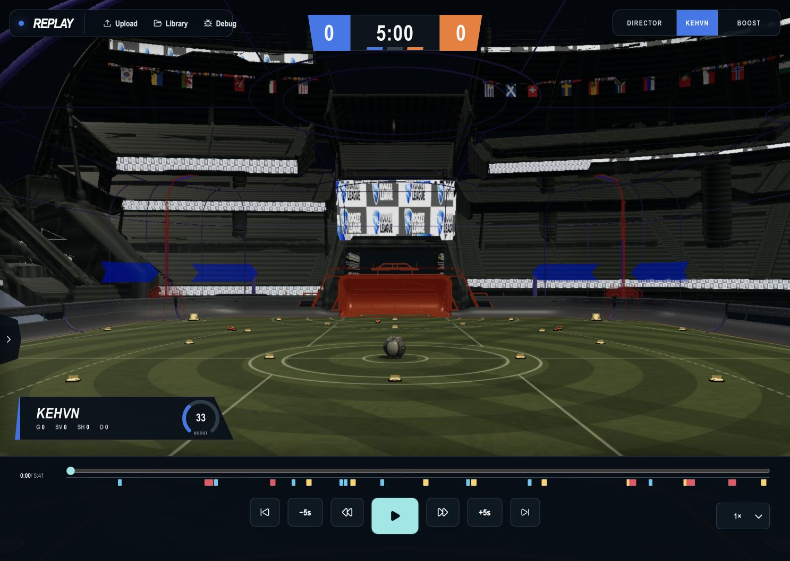
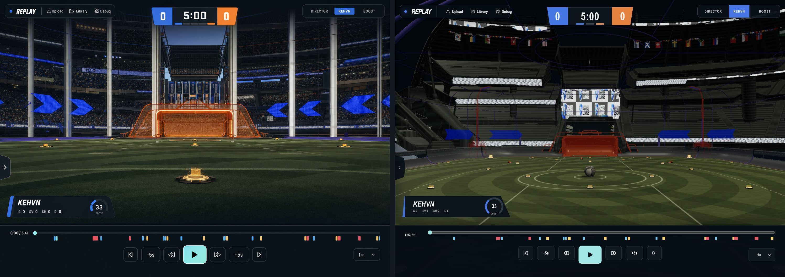
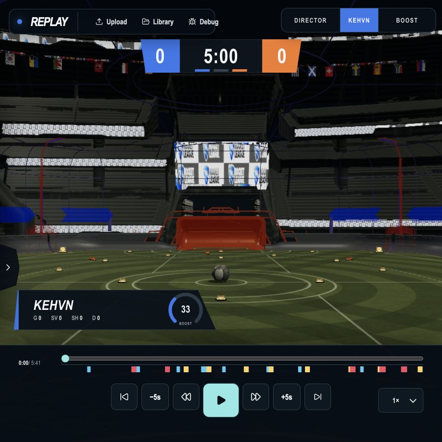
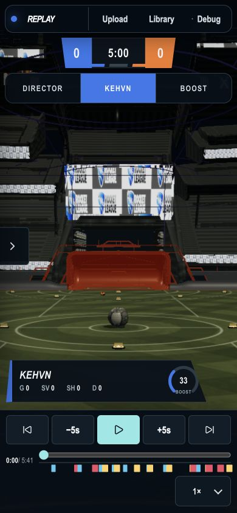

# Replay UI Design QA

Audit date: 2026-07-12

## Scope

- Surface: the replay viewer chrome and its core playback flow.
- User goal: open a replay, understand the match state, choose a camera/player, and scrub or play the replay without layout friction.
- Visual source: `/Users/viburamineni/.codex/attachments/24c0d5e0-b569-496d-8273-7d257b4a648a/image-1.png`.
- Browser state: bundled sample replay, paused at the start, Director camera, KEHVN selected, boost rendering off, 1x speed, roster closed.

## Grievance resolution

- Removed the loose, browser-default select presentation from camera and speed controls while retaining the native accessible inputs.
- Locked the floating header, scoreboard, camera dock, player HUD, roster tab, timeline, transport cluster, and speed control to the reference geometry.
- Removed stray labels and icons that made the chrome busier than the reference.
- Corrected the transport icon order and made the play control the clear visual anchor.
- Changed the default Director view to a stable establishing shot and restored real Champions Field backdrop depth.
- Eliminated horizontal overflow and control collisions at desktop, tablet, and mobile sizes.
- Preserved labels, focus treatment, reduced-motion support, native selects, button names, and closed-drawer focus isolation.

## Fresh audit evidence

### 1. Open the sample replay — healthy

The sample replay opens from the upload screen and reaches the complete viewer without an error state.

### 2. Desktop replay view, 1487 x 1058 — healthy

- Header: 420 x 52 at (18, 18).
- Scoreboard: 328 x 68 at (579.5, 28).
- Camera dock: 316 x 50 at (1153, 18).
- Player HUD: 412 x 82 at (28, 748).
- Timeline: 1487 x 198 at y=860.
- Transport cluster: 546 x 68 at x=470.5.
- Speed control: 101 x 50 at (1348, 948).
- Horizontal overflow: 0 px.

### 3. Reference comparison — healthy for replay chrome

The layout, hierarchy, colors, clipped score panels, segmented clock, camera dock, player card, timeline, transport order, and speed control match the reference direction. The real extracted Champions Field scene naturally differs from the generated stadium artwork; that is a scene-art difference, not an unresolved replay-UI grievance.

### 4. Tablet replay view, 900 x 900 — healthy

The header and camera dock remain separated, the scoreboard moves below them, the HUD stays above the replay rail, all desktop transport controls remain visible, and horizontal overflow is 0 px.

### 5. Mobile replay view, 390 x 844 — healthy

The compact header, scoreboard, camera dock, HUD, mobile transport row, timeline, event markers, and speed control all remain inside the viewport. Horizontal overflow is 0 px.

### 6. Core interactions — healthy

- Play changes the control to Pause; Pause returns it to Play.
- Camera mode changes Director -> Free -> Director and the visible value stays synchronized.
- Playback speed changes 1x -> 2x -> 1x and the visible value stays synchronized.
- Jump backward changes the replay time by exactly -5 seconds.
- Jump forward changes the replay time by exactly +5 seconds.
- Go to replay start returns the timeline to 0.
- Final state: Director camera, 1x speed, paused at 0, zero horizontal overflow.
- Browser warnings and errors: none.

## Accessibility evidence and limits

- Native selects remain labeled and operable beneath the custom visual values.
- Every tested playback button has a distinct accessible name.
- The closed roster drawer has `aria-hidden="true"` and `inert`, preventing focus from entering off-screen content.
- Visible focus styling and reduced-motion rules remain in the stylesheet.
- Screenshot and DOM checks do not prove full WCAG conformance; a screen-reader pass and automated contrast audit would still be separate certification work.

## Automated verification

- `npm test`: 30 files passed, 205 tests passed.
- `npm run build`: passed.
- `git diff --check`: passed.

final result: passed
